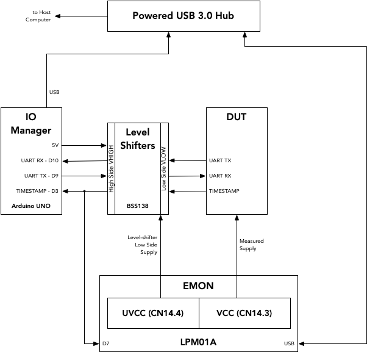
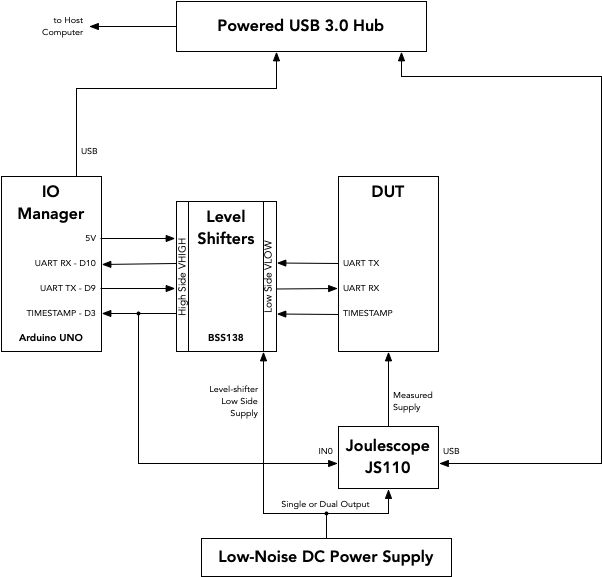
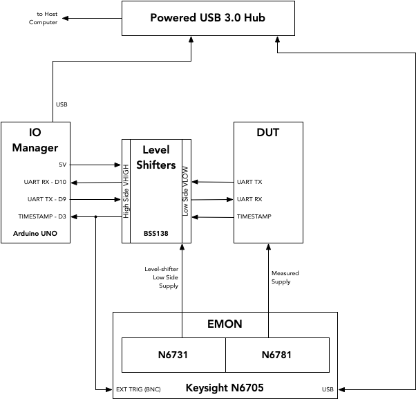
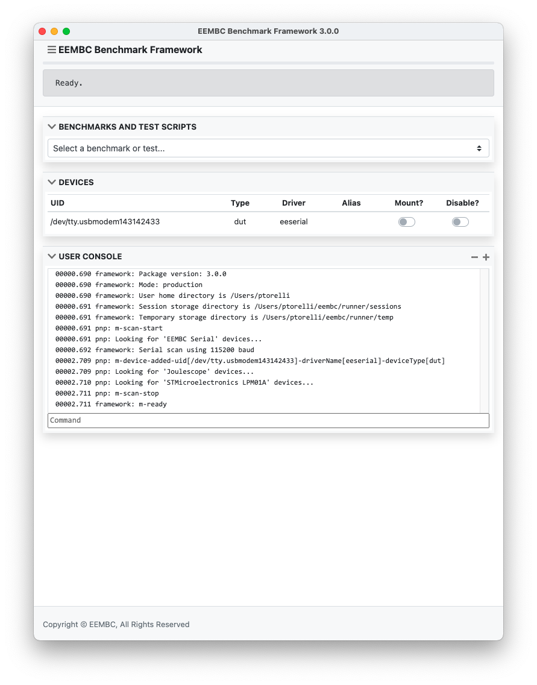
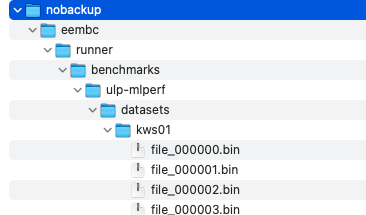
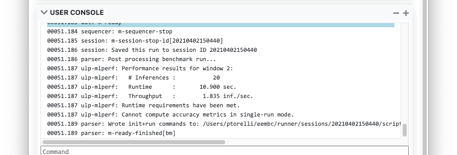

# Introduction

This is an alpha release of the benchmark runner for ULPMark&trade;-ML and tinyMLperf. It is still missing several features as we are currently debugging and developing.

The goal is to facilitate bringup of the firmware, not collect official scores. This software is provided solely for the purpose of cross-development between EEMBC and MLCommons's tinyMLperf. This repository will be removed and replaced with an official release once development is done.

# Current Status

Still in alpha, but we've started adding support for computing accuracy metrics from ground truths (for model `ic01` only), and added the energy compatibility plugin.

# Performance Mode vs. Energy Mode

Throughout this document, you will see constant distinctions made between *performance* mode and *energy* mode. The reason why the two collection modes have been separated is due to how the device under test, aka the DUT, behaves in both modes.

The DUT differs like this:

| Performance Mode             | Energy Mode                        |
| ---------------------------- | ----------------------------       |
| Connects to Host PC          | Electrically isolated from Host PC |
| Talks directly to the Runner | Talks directly to IO Manager       |
| Baud rate can be changed     | Baud rate fixed at 9600            |
| Timestamp is an MCU counter  | Timestamp is GPIO falling-edge     |

Because of these key differences, two different plug-ins are provided in the "Benchmarks and Test Scripts" drop-down, one for each of the two modes.

# Hardware Setup

## Performance Mode Hardware

Port the firmware to your device from the test harness based on the EEMBC ULPMark-ML [test harness sample code](https://github.com/eembc/testharness-ulpmark-ml), or the [MLCommons tinyMLPerf reference code](https://github.com/mlcommons/tiny/tree/master/v0.1). Both sample templates are un-implemented, but provide the same serial monitor interface.

Compile as `EE_CFG_ENERGY_MODE 0` (see the `#define` in `monitor/th_api/th_config.h`). Program the `th_timestamp` function to return the current microseconds since boot time (e.g., with a MCU counter or system timer).

Connect the DUT to the system with a USB-TTL or USB-debugger cable so that it appears as serial port to the system at 115200 baud, 8N1. (If using a faster Baud rate, see the configuration section at the end of this document.) To verify this step, you should be able to open a terminal program (such as PuTTY, TeraTerm or the Arduino IDE Serial Monitor), connect to the device, and issue the `name%` command successfully.

Proceed to "Software Setup" below.

## Energy Mode Hardware

Port the firmware to your device from the test harness based on the EEMBC ULPMark-ML [test harness sample code](https://github.com/eembc/testharness-ulpmark-ml), or the [MLCommons tinyMLPerf reference code](https://github.com/mlcommons/tiny/tree/master/v0.1). Both sample templates are un-implemented, but provide the same serial monitor interface.

Compile as `EE_CFG_ENERGY_MODE 1` (see the `#define` in `monitor/th_api/th_config.h`). Program the `th_timestamp` to generate a falling edge on a GPIO that lasts at least one microsecond (hold time).

Since Energy Mode supplies power to the device at a different voltage than the host USB, we need to electrically isolate the DUT. This is accomplished through two pieces of hardware: 1) three level shifters (one each for UART-TX, UART-RX and GPIO timestamp), an Arduino Uno. The Uno is referred to as the "IO Manager" and provides a UART passthrough to/from the host Runner.

The recommended level shifters are the 4-channel BSS138 devices, as sold by [AdaFruit](https://www.adafruit.com/product/757). Simply plug these into a breadboard, provide 5V on the high-side voltage from the Arduino, and VCC from another power supply. This LevelShifter VCC must match the GPIO output of the DUT.

The Runner supports three different energy monitors, aka *EMON*:

1. [STMicroelectronics LPM01A](https://www.st.com/en/evaluation-tools/x-nucleo-lpm01a.html)
2. [Joulescope JS110 plus a low-noise power supply](https://www.joulescope.com/products/joulescope-precision-dc-energy-analyzer)
3. [Keysight N6705](https://www.keysight.com/en/pd-2747858-pn-N6705C/dc-power-analyzer-modular-600-w-4-slots?cc=US&lc=eng) with 1xN6781+1xN6731 or 2xN6781

Depending on the EMON you use, there are three different Runner schematics. 

For the LPM01A:

For the JS110:

For the N6705:

The EMON must supply a MEASURED voltage and an UNMEASURED voltage. The former supplies the entire DUT board, the latter supplies just the level shifters. 

**IMPORTANT NOTE: Only ONE power supply is allowed to supply the DUT during measurement.** Any additional circuitry on the board will contribute to power and lower the score. The run rules allow cutting traces, desoldering bridges, removing jumpers or setting switches to disable ancillary hardware on the platform (e.g., debug hardware, or kit sensors).

To assist in making the setup more compact, EEMBC provides a link to an [Arduino shield](https://www.eembc.org/iotmark/index.php#framework) for faster connectivity.

For first-time setup, it really helps to have a small logic analyzer or a digital oscilloscope to help trace the output of the DUT at various stages of the isolation path. For example, is the Rx transmission from the host making it to the UART input? Is the boot message from the DUT coming from the right TX pin on the header? Is the timestamp held low long enough?

Proceed to "Software Setup" below.

# Software Setup

## Download and Start the Host UI Runner

This is a very brief user guide for booting the framework and testing connectivity.

There are three OS release: Mac Big Sur / Catalina, Ubuntu 18.04 (probably works on 20.04), and Win10. The macOS version is provided as a \*.app file. Linux and Windows are provided as zip-files. Open the application by double-clicking the icon in macOS, running `EEMBC Benchmark Framework.exe` in windows, or `benchmark-framework` in Linux. if everything booted properly this window appears:

When the Host UI Runner first boots, it creates two things: an initialization file in `$HOME/.eembc.ini`, and directory structure to store benchmark input (such as datasets for inference) and output data (such as session logs from previous runs). By default, this is created under `$HOME/eembc`, but can be changed in the INI file, explained at the end of this document.

## Selecting Performance Mode

Under the `Benchmarks and Test Scripts` panel, choose one of the two benchmark modes. We'll start with `ML Performance`. A configuration panel will appear:

Take note of the directory (in red) in the center of the screen. This is a work directory that has been created. Unzip the `dummyfiles_ulp-mlperf.zip` file into that directory to create the following tree structure. Note these files are bogus random binary data and are provided for testing `kws01` and `ic01`. Since the framework determines where to look for input files based on the model response from the DUT, you can rename this to match whatever NN you are targeting.

**The Runner will look in the subfolder defined in the firmware, and can be checked with the `profile%` command.**

Plug in the USB device connected to the device under test (DUT). The device should appear under the device console. Some operating systems take longer than others to scan USB, so this could take anywhere from a few hundred milliseconds to a few seconds.

If you see warnings about missing VISA drivers, ignore them. (The code supports VISA test hardware, but it is irrelevant for performance testing. If the VISA scan takes too long, refer to the configuration options at the end of this document.)

Click `Initialize` under the benchmark section and the runner will mount the device and handshake. At this point, you can issue commands to the DUT by typing `dut <command>` in the User Console input line. Also note that the model name in the configuration panel has been set to `ic01`. Handshaking with the DUT causes the DUT to print a special query message alerting the runner of the correct model inputs to use.

At this point, clicking `Run` will download the first binary input to the DUT using the `db` commands (as stated above, depending on the mode) and collect a timing score. The difference between the two `m-lap-us` statements is the # of microseconds elapsed. The value will depend on the resolution of the timer implemented on your DUT.

Running too few iterations will result in a low performance number if the device is fast. Try increasing the number of run iterations to see if the performance increases.

## Selecting Energy Mode

Under the `Benchmarks and Test Scripts` panel, choose one of the two benchmark modes. We'll start with `ML Energy`. A configuration panel will appear that looks identical to the `ML Performance` panel, except the "Validation" option is disabled temporarily, since running validation in energy mode is incredibly slow at 9600 baud.

Refer to the section on input files mentioned in performance mode, above. It is the same for both modes.

Plug in the Energy Monitor (EMON) and the IO Manager, it should look like this:

Two devices appear, the EMON and the IO Manager. If you are seeing a JS110 or N6705, they will also appear. The system will use the first EMON it sees unless you disable it with the toggle buttons.

Click `Initialize` under the benchmark section and the runner will mount the device and handshake. If you click on the "+" sign in the upper-right of the User Console, and grow the window, it should look something like this:

The colors indicate which device is talking. Green is the IO Manager, Tan is the EMON, and Blue is the DUT. A lot of synchronized communcaiton is required to perform a simple handshake!

(If you see the DUT printing random characters as soon as it is powered on--in this case `;#;;`--it is due to invalid data in the UART buffer being flushed. Not all hardware does this, it depends on initializaiton. You can simply ignore it.)

Unlike Performance Mode, you cannot talk directly to the DUT right now because it is powered down. To issue a DUT command, scroll down to the EMON control panel, turn on the power, and then issue `io dut <command>`. The `io` prefix is necessary because you are sending the command to the IO Manager, which then passes it down to the DUT at the correct voltage.

At this point, clicking `Run` will the first binary input to the DUT using the `db` commands (as stated above, depending on the mode) and collect a timing score. When it completes, an energy window will pop up at the bottom of the screen, like this:

Each time a run completes successfully a new EMON window pops up; close them with the "x" in the upper-right corner. 

The User Console will indicate the energy and power in between the timestamps (plus a small time buffer of a few hundred microseconds to make sure we're in the middle of the run).

# Custom Configuration

The default behavior of the runner can be modified with an initialization file. On startup, the Runner will create a default `.eembc.ini` in your home directory. On Linux and macOS this is `$HOME`, on Win10 it is `%USERPROFILE%`.

~~~
% cat $HOME/.eembc.ini
root=/Users/ptorelli
dut-baud=115200
dut-boot-mv=3000
default-timeout-ms=5000
emon-drop-thresh-pct=0.1
timestamp-hold-us=50
umount-on-error=true
use-crlf=false
use-visa=true
~~~

These three are most relevant for the ML effort:

* `root` changes where the Runner looks for input files, and saves output sessions.

* `dut-baud` sets the default Baud rate for serial detection in performance mode.

* `dut-boot-mv` selects the voltage used while querying the device on initialization (prior to making the EMON voltage setting available to the user).

Other settings are listed here for the sake of completeness:

* `default-timeout-ms` is the default timeout value for unspecified asynchronous scripting.

* `emon-drop-thresh-pct` is the maximum number of dropped samples allowed for slow EMON connections.

* `timestamp-hold-us` is the number of microseconds to filter noisy timestamps

* `umount-on-error` causes all devices to un-mount if there is an error, forcing re-initialization

* `use-crlf` prints CRLF at the end of all log file messages, rather than a single LF.

* `use-visa` enables/disables communication with the VISA drivers on the system. Some drivers are quite slow to detect, and if no VISA devices are used, it can speed the Runner boot-time by disabling this.

# Debugging Device Auto-detection

When the Runner boots, it scans all of the scans all the serial ports searching for compatible firmware. During performance mode, it does this by sending the `name%` command and waiting up to 2 seconds for the port to respond with `m-ready`. If successful, the device will appear in the device console. If it does not show up, it could be due to the following:

1. The Runner's default baud rate does not match the device's baud rate; make sure the baud rates are the same
2. The device took too long to reply; minimize the amount of code executing between power-on and `m-ready`.
3. The USB subsystem did not initialize before the plug-in event was sent; exit the runner, plug the device in, restart the runner

Also, every time a USB device changes, the system needs to perform a scan for a long list of hardware. If you have many USB devices connected to your system and this is taking a long time, it is recommended to not swap USB devices while running.

# Hash Check

MD5 hashes are provided in the `dist` folder. Run `md5sum --check hashes.md5` from the `dist` folder to verify

# Copyright License

This software is the copyright of EEMBC, and is currently released under Apache 2.0.
